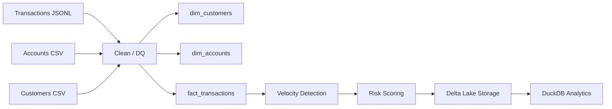

Nedbank Data Engineering Challenge

Overview

This repository implements a Gold-layer data pipeline for transaction analytics using Apache Spark, Delta Lake, and DuckDB.

The solution transforms raw transaction, account, and customer data into:
	•	dimensional models
	•	an enriched fact table
	•	behavioral risk indicators
	•	an explainable composite risk score

Architecture

Technology Stack
	•	Apache Spark (PySpark)
	•	Delta Lake
	•	DuckDB
	•	Python

Gold Layer Outputs

The pipeline writes the following Delta tables:
	•	output/gold/dim_customers
	•	output/gold/dim_accounts
	•	output/gold/fact_transactions

The fact table is partitioned by:
	•	province
	•	transaction_date

Data Quality Controls

The pipeline applies basic quality rules during transformation:
	•	deduplication by transaction_id
	•	null checks on critical transaction fields
	•	currency validation against ZAR
	•	deterministic surrogate keys with xxhash64

Intelligence Layer

The fact table is enriched with the following signals:
	•	high_value_flag
	•	channel_risk
	•	txn_hour
	•	txn_per_hour
	•	velocity_flag
	•	risk_score

Risk Logic

The composite risk score combines three dimensions:
	1.	Velocity: transactions per customer per hour
	2.	Amount: medium and high transaction thresholds
	3.	Channel exposure: ATM/USSD/POS weighting

This makes the scoring explainable and easy to extend.

Key Analytical Findings

1. Regional activity

DuckDB analysis showed that transaction activity is concentrated in the major provinces, with Gauteng leading both transaction count and total amount.

2. High-value transactions are rare but important

Only a very small portion of the data falls into the high-value segment, but these transactions carry disproportionately high financial exposure.

3. Velocity anomaly detection works

After calibrating thresholds to the observed data distribution, the velocity signal identified a very small number of rare behavioral spikes.

4. Composite scoring separates normal vs suspicious behavior

The final risk score produces a realistic spread from baseline activity to rare extreme anomalies.

DuckDB Results

Province summary

Province	Transactions	Total Amount	Avg Transaction
Gauteng	297,392	214,261,800	720.47
Western Cape	183,137	132,826,100	725.28
KwaZulu-Natal	154,102	110,861,200	719.40
Eastern Cape	95,651	68,864,500	719.96
Limpopo	78,465	56,524,600	720.38
Mpumalanga	60,582	43,896,500	724.58
North West	50,549	36,256,300	717.25
Free State	49,627	35,541,700	716.18
Northern Cape	30,495	21,660,100	710.28

Channel summary

Channel	Transactions	Avg Amount
POS	350,299	719.30
APP	299,707	722.49
ATM	150,468	720.89
EFT	99,715	721.64
USSD	79,705	720.85
INTERNAL	20,106	711.41

Velocity distribution

Velocity Flag	Transactions	Avg Velocity
LOW	999,945	1.0023
MEDIUM	51	3.0
HIGH	4	4.0

Risk score distribution

Risk Score	Count
4.5	1
4.0	1
3.5	3
3.0	3,114
2.5	4,714
2.0	19,292
1.5	20,938
1.0	238,740
0.5	324,643
0.0	388,554

Example High-Velocity Anomaly

One customer exhibited four transactions within the same hour in Gauteng across multiple channels (APP, ATM, POS) with escalating amounts, including transactions above 2,000 and 5,000. This pattern is a useful example of behavioral anomaly detection rather than pure high-amount fraud detection.

How to Run

rm -rf ../output/gold/*
python pipeline/gold.py

Query with DuckDB

Start Python and connect like this:

import duckdb

con = duckdb.connect()
con.execute("LOAD delta")

Example query:

con.execute("""
SELECT
    risk_score,
    COUNT(*) AS cnt
FROM delta_scan('../output/gold/fact_transactions')
GROUP BY risk_score
ORDER BY risk_score DESC
""").df()

Versioning
	•	v2.0 — Gold pipeline with intelligence layer
	•	v2.1 — README and submission baseline improvements
	•	v2.2 — current submission milestone

Repository

GitHub: https://github.com/sandorvas/nedbank-data-engineering-challenge

⸻

v3 – Explainability Layer (pipeline/gold.py)

"""
Gold Layer Pipeline (Delta Lake + Spark) – v3 Explainability

Enhancements:
- Adds explainable risk outputs
    - risk_band
    - why_flagged
"""

from delta import configure_spark_with_delta_pip
from pyspark.sql import SparkSession
from pyspark.sql.functions import (
    col, concat_ws, count, countDistinct, current_timestamp,
    floor, hour, lit, months_between, to_timestamp, when, xxhash64
)
from pyspark.sql.window import Window
from pyspark.sql.functions import count as spark_count

DATA_DIR = "../data"
OUTPUT_DIR = "../output/gold"
OUTPUT_FORMAT = "delta"

TRANSACTIONS_PATH = f"{DATA_DIR}/transactions.jsonl"
ACCOUNTS_PATH = f"{DATA_DIR}/accounts.csv"
CUSTOMERS_PATH = f"{DATA_DIR}/customers.csv"

FACT_PARTITIONS = ["province", "transaction_date"]

def create_spark():
    return configure_spark_with_delta_pip(
        SparkSession.builder
        .appName("gold-layer")
        .config("spark.sql.extensions", "io.delta.sql.DeltaSparkSessionExtension")
        .config("spark.sql.catalog.spark_catalog", "org.apache.spark.sql.delta.catalog.DeltaCatalog")
        .config("spark.sql.session.timeZone", "UTC")
    ).getOrCreate()

spark = create_spark()
spark.sparkContext.setLogLevel("ERROR")

def sk(c):
    return xxhash64(col(c)).cast("bigint")

def write_table(df, path, parts=None):
    w = df.write.mode("overwrite").format(OUTPUT_FORMAT).option("overwriteSchema", "true")
    if parts:
        w = w.partitionBy(*parts)
    w.save(path)

def load():
    return (
        spark.read.json(TRANSACTIONS_PATH),
        spark.read.csv(ACCOUNTS_PATH, header=True, inferSchema=True),
        spark.read.csv(CUSTOMERS_PATH, header=True, inferSchema=True)
    )

def clean(df):
    return (
        df.dropDuplicates(["transaction_id"])
        .withColumn("dq_flag",
            when(col("transaction_id").isNull(), "NULL_REQUIRED")
            .when(col("account_id").isNull(), "NULL_REQUIRED")
            .when(col("transaction_date").isNull(), "NULL_REQUIRED")
            .when(col("amount").isNull(), "NULL_REQUIRED")
            .when(col("currency").isNotNull() & (col("currency") != "ZAR"), "CURRENCY_VARIANT")
            .otherwise(lit(None).cast("string"))
        )
    )

def dim_customers(df, now):
    return (
        df.dropDuplicates(["customer_id"])
        .withColumn("age_years", floor(months_between(now, col("dob")) / 12))
        .withColumn("age_band",
            when(col("age_years") >= 65, "65+")
            .when(col("age_years") >= 56, "56-65")
            .when(col("age_years") >= 46, "46-55")
            .when(col("age_years") >= 36, "36-45")
            .when(col("age_years") >= 26, "26-35")
            .when(col("age_years") >= 18, "18-25")
        )
        .select(sk("customer_id").alias("customer_sk"), "customer_id", "gender", "province",
                "income_band", "segment", col("risk_score").cast("int"), "kyc_status", "age_band")
    )

def dim_accounts(df):
    return (
        df.dropDuplicates(["account_id"])
        .select(sk("account_id").alias("account_sk"), "account_id",
                col("customer_ref").alias("customer_id"), "account_type", "account_status",
                col("open_date").cast("date"), "product_tier", "digital_channel",
                col("credit_limit").cast("decimal(18,2)"), col("current_balance").cast("decimal(18,2)"),
                col("last_activity_date").cast("date"))
    )

def fact(tx, acc, cust, now):
    j = tx.join(acc.select("account_sk","account_id","customer_id"),"account_id")\
          .join(cust.select("customer_sk","customer_id"),"customer_id")

    base = j.select(
        sk("transaction_id").alias("transaction_sk"),
        "transaction_id","account_sk","customer_sk",
        col("transaction_date").cast("date"),
        to_timestamp(concat_ws(" ",col("transaction_date"),col("transaction_time"))).cast("timestamp_ntz").alias("transaction_timestamp"),
        "transaction_type","merchant_category",
        lit(None).cast("string").alias("merchant_subcategory"),
        col("amount").cast("decimal(18,2)"),
        lit("ZAR").alias("currency"),
        "channel",col("location.province").alias("province"),
        "dq_flag",now.cast("timestamp_ntz").alias("ingestion_timestamp")
    )

    base = base.withColumn("high_value_flag", when(col("amount")>10000,"HIGH").otherwise("NORMAL"))
    base = base.withColumn("channel_risk",
        when(col("channel").isin("ATM","USSD"),"HIGH")
        .when(col("channel")=="POS","MEDIUM")
        .otherwise("LOW")
    )
    base = base.withColumn("txn_hour", hour(col("transaction_timestamp")))

    w = Window.partitionBy("customer_sk","transaction_date","txn_hour")
    base = base.withColumn("txn_per_hour", spark_count("*").over(w))
    base = base.withColumn("velocity_flag",
        when(col("txn_per_hour")>20,"HIGH")
        .when(col("txn_per_hour")>10,"MEDIUM")
        .otherwise("LOW")
    )

    # --- v3 explainability ---
    base = base.withColumn("risk_band",
        when((col("velocity_flag")=="HIGH") | (col("high_value_flag")=="HIGH"),"HIGH")
        .when((col("velocity_flag")=="MEDIUM"),"MEDIUM")
        .otherwise("LOW")
    )

    base = base.withColumn("why_flagged",
        when(col("velocity_flag")=="HIGH", "High velocity")
        .when(col("high_value_flag")=="HIGH", "High amount")
        .when(col("channel_risk")=="HIGH", "High-risk channel")
        .otherwise("Normal behaviour")
    )

    return base.dropDuplicates(["transaction_id"])

def validate(df,name):
    key = {"fact":"transaction_sk","accounts":"account_sk","customers":"customer_sk"}[name]
    r = df.select(count("*"),countDistinct(key)).collect()[0]
    print(f"{name}: rows={r[0]}")

def main():
    print("🚀 Gold pipeline v3")
    now = current_timestamp()
    tx,acc,cust = load()
    tx = clean(tx)

    dc = dim_customers(cust, now)
    da = dim_accounts(acc)
    f = fact(tx,da,dc,now)

    validate(dc,"customers")
    validate(da,"accounts")
    validate(f,"fact")

    write_table(dc,f"{OUTPUT_DIR}/dim_customers")
    write_table(da,f"{OUTPUT_DIR}/dim_accounts")
    write_table(f,f"{OUTPUT_DIR}/fact_transactions",FACT_PARTITIONS)

    print("✅ Done")

if __name__ == "__main__":
    main()

GitHub: https://github.com/sandorvas/nedbank-data-engineering-challenge

## 📦 Version History

- **v3.0** — Explainability layer added (risk_band, why_flagged) → explainable risk analytics
- **v2.2** — Final submission baseline: validated risk scoring pipeline and complete analytical outputs
- **v2.1** — Submission baseline: Gold pipeline with intelligence layer (velocity, channel risk, high-value detection)
- **v2.0** — Introduced behavioral analytics (velocity detection) and composite risk scoring
- **v1.0** — Core Gold pipeline (dimensional modeling and fact table generation)

Author

Sandor Vas
