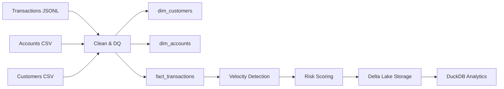

Nedbank Data Engineering Challenge

Overview

This repository implements a Gold-layer data pipeline for transaction analytics using Apache Spark, Delta Lake, and DuckDB.

The solution transforms raw transaction, account, and customer data into:

	•	dimensional models
	•	an enriched fact table
	•	behavioral risk indicators
	•	an explainable composite risk score

⸻

Architecture

⸻

Technology Stack

	•	Apache Spark (PySpark)
	•	Delta Lake
	•	DuckDB
	•	Python

⸻

Gold Layer Outputs

The pipeline writes the following Delta tables:

	•	output/gold/dim_customers
	•	output/gold/dim_accounts
	•	output/gold/fact_transactions

Partitioning:

	•	province
	•	transaction_date

⸻

Data Quality Controls:

	•	deduplication by transaction_id
	•	null checks on critical fields
	•	currency validation (ZAR)
	•	deterministic surrogate keys (xxhash64)

⸻

Intelligence Layer

The fact table includes:

	•	high_value_flag
	•	channel_risk
	•	txn_hour
	•	txn_per_hour
	•	velocity_flag
	•	risk_score

⸻

Key Findings

	1.	Regional concentration
		Gauteng leads both transaction volume and total value.
	2.	High-value transactions
		Rare but carry disproportionate financial exposure.
	3.	Velocity detection
		Identifies rare behavioral spikes.
	4.	Risk scoring
		Produces realistic separation between normal and anomalous behavior.

⸻

DuckDB Results 

Province Summary

Province        Transactions    Total Amount    Avg Transaction
Gauteng         297,392         214,261,800     720.47
Western Cape    183,137         132,826,100     725.28
KwaZulu-Natal   154,102         110,861,200     719.40
Eastern Cape     95,651          68,864,500     719.96
Limpopo          78,465          56,524,600     720.38
Mpumalanga       60,582          43,896,500     724.58
North West       50,549          36,256,300     717.25
Free State       49,627          35,541,700     716.18
Northern Cape    30,495          21,660,100     710.28

⸻

Velocity Distribution

Velocity Flag	Transactions	Avg Velocity
	 LOW	999,945		1.0023
	 MEDIUM	51		3.0
	 HIGH	4		4.0

⸻

Risk Score Distribution

Risk 	Score	Count
	4.5	1
	4.0	1
	3.5	3
	3.0	3,114
	2.5	4,714
	2.0	19,292
	1.5	20,938
	1.0	238,740
	0.5	324,643
	0.0	388,554

⸻

Example Anomaly

A customer performed 4 transactions within one hour across multiple channels (APP, ATM, POS) with increasing amounts.

This illustrates behavioral anomaly detection, not just high-value fraud.

⸻

How to Run

rm -rf ../output/gold/*
python pipeline/gold.py

⸻

Query with DuckDB

import duckdb

con = duckdb.connect()
con.execute("LOAD delta")

con.execute("""
SELECT risk_score, COUNT(*)
FROM delta_scan('../output/gold/fact_transactions')
GROUP BY risk_score
""").df()

⸻

📦 Version History

	•	v3.0 — Explainability layer (risk_band, why_flagged)
	•	v2.2 — Final submission baseline with validated analytics
	•	v2.1 — Intelligence layer (velocity, channel risk, high-value detection)
	•	v2.0 — Behavioral analytics (velocity detection)
	•	v1.0 — Core Gold pipeline

⸻

Repository

https://github.com/sandorvas/nedbank-data-engineering-challenge

⸻

Author

Sandor Vas
