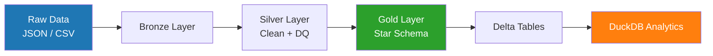

# 🏦 Nedbank Data Engineering Challenge  
### Gold Layer Pipeline (Spark + Delta + DuckDB)

---

## 🚀 Overview

This project implements a **modern data engineering pipeline**:

- 🔹 Bronze → Raw ingestion (JSON / CSV)
- 🔹 Silver → Cleaning & enrichment
- 🔹 Gold → Star schema (Dimensions + Fact)

Technologies used:

- Apache Spark (PySpark)
- Delta Lake (ACID storage)
- DuckDB (analytical querying)

---

## 🧱 Architecture



---

## 📊 Data Model (Gold Layer)

### Dimensions

- `dim_customers`
- `dim_accounts`

### Fact Table

- `fact_transactions`

---

## ⚙️ Pipeline Features

### ✅ Data Quality (DQ)
- Deduplication (transaction_id, account_id, customer_id)
- Null checks on critical fields
- Currency validation (ZAR standardization)

### ✅ Surrogate Keys
- Deterministic BIGINT keys using `xxhash64`
- Stable across reruns

### ✅ Delta Lake
- ACID-compliant tables
- Schema evolution enabled
- Safe overwrite for development

### ✅ Time Handling (IMPORTANT)
- Spark session forced to **UTC**
- All timestamps stored as **timezone-neutral**
- Ensures compatibility with DuckDB

---

## 🔎 Analytics (DuckDB)

Example query:

```sql
SELECT
    province,
    COUNT(*) AS transactions,
    SUM(amount) AS total_amount,
    AVG(amount) AS avg_transaction
FROM delta_scan('../output/gold/fact_transactions')
GROUP BY province
ORDER BY total_amount DESC;
```

---

## 🧠 Key Insights

### 1. Geographic distribution
- Transaction volume varies significantly by province
- Gauteng dominates total activity

### 2. Channel behavior
- POS and APP dominate transaction volume
- All channels show similar average transaction values

### 3. Merchant analysis
- Categories differ in volume
- BUT average transaction size is consistent

---

## 🚨 Critical Finding

> **Transaction values are statistically distributed but not behaviorally segmented**

- Wide value range: `1 → 50,000`
- Standard deviation: ~1283
- BUT:
  - Same average (~720) across:
    - provinces
    - channels
    - merchant categories

---

## 💥 Interpretation

This suggests:

- Data has **statistical realism**
- BUT lacks **domain-driven behavior**

👉 Likely:
- Synthetic dataset
- Normalized transaction generator
- Anonymized data with removed signal

---

## 🏆 Key Statement

> “The dataset preserves statistical variability but removes behavioral differentiation, limiting its usefulness for real-world decision-making.”

---

## ▶️ How to Run

```bash
python pipeline/gold.py
```

---

## 🧪 Query with DuckDB

```python
import duckdb

con = duckdb.connect()
con.execute("LOAD delta")

df = con.execute("""
SELECT *
FROM delta_scan('../output/gold/fact_transactions')
LIMIT 5
""").df()

print(df)
```

---

## 📦 Output

```
output/gold/
├── dim_customers/
├── dim_accounts/
└── fact_transactions/
```

---

## 🧠 Author Perspective

This project demonstrates:

- End-to-end data pipeline design
- Delta Lake production patterns
- Analytical validation beyond dashboards
- Critical evaluation of data realism

---

## 🚀 Next Steps

- Add time-series analysis
- Introduce behavioral segmentation
- Build anomaly detection layer
- Deploy pipeline to cloud (GCP / AWS)

---
