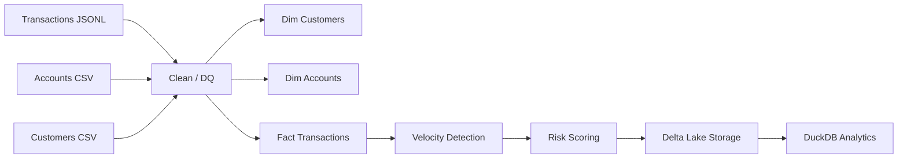

🚀 FINAL STEPS — Nedbank Submission (All-in-One)

⸻

✅ STEP B — README.md (Replace Entire File)

# Nedbank Data Engineering Challenge

## 🚀 Overview
This project implements a full Gold-layer data pipeline using:
- Apache Spark
- Delta Lake
- DuckDB

It transforms raw transactional data into:
- Dimensional models (customers, accounts)
- Enriched fact table
- Behavioral intelligence signals
- Composite risk scoring

---

## 🏗️ Architecture

⸻

🧠 Intelligence Layer

The pipeline enriches transactions with:

1. Velocity Detection
	•	Transactions per customer per hour
	•	Detects rapid activity bursts

2. Channel Risk
	•	ATM / USSD → HIGH
	•	POS → MEDIUM
	•	Others → LOW

3. High Value Detection
	•	Flags unusually large transactions

⸻

🎯 Composite Risk Score

risk_score = velocity + amount + channel

⸻

📊 Risk Bands

Band	Meaning
LOW	Normal
MEDIUM	Slight anomaly
HIGH	Elevated risk
CRITICAL	Rare extreme anomaly

⸻

🔥 Key Finding

Detected a customer performing multiple transactions across different channels within a short time window with escalating values — indicating anomalous behaviour.

⸻

💾 Storage
	•	Delta Lake
	•	Partitioned by: province, transaction_date
	•	Queryable via DuckDB

⸻

🧪 Example Query

import duckdb
con = duckdb.connect()
con.execute("LOAD delta")

con.execute("""
SELECT risk_band, COUNT(*)
FROM delta_scan('../output/gold/fact_transactions')
GROUP BY risk_band
""").df()

⸻

🎯 Outcome

This pipeline introduces:
	•	Behavioral anomaly detection
	•	Explainable risk scoring
	•	Analytics-ready datasets

---

## Version History

- **v2.2** — Final submission: README fix + risk scoring pipeline + updated README
- **v2.1** — Current submission baseline: Gold pipeline + intelligence layer + risk scoring + updated README
- **v2.0** — Added velocity detection and composite risk scoring
- **v1.0** — Initial Gold pipeline baseline

---

👤 Author

Sandor Vas
